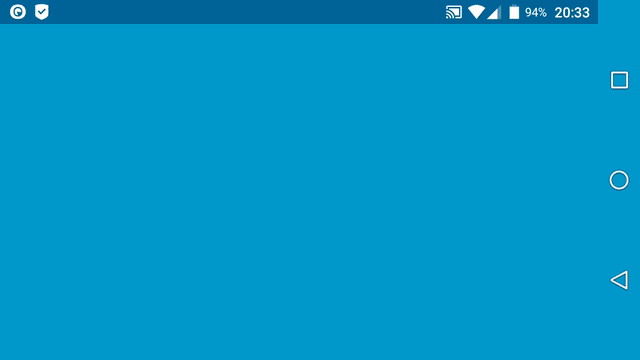
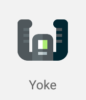
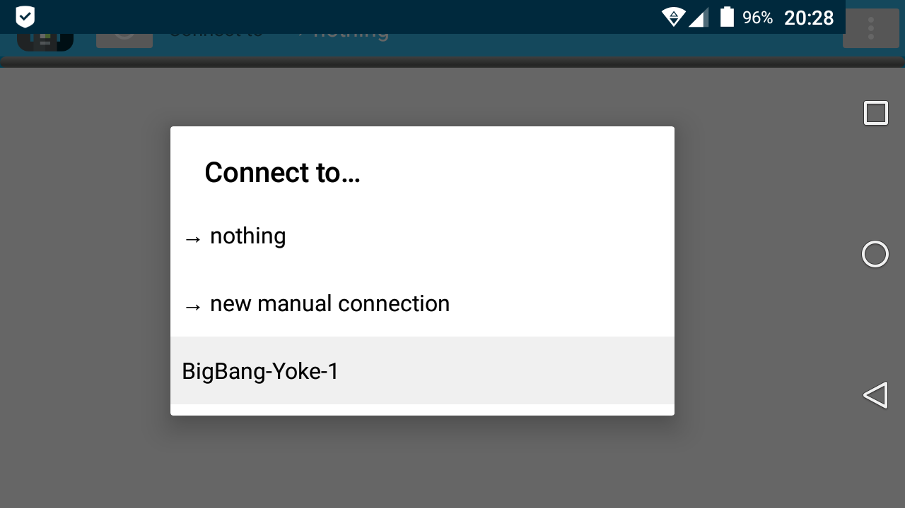

# Yoke Webview (desktop client)

> Yoke is a hackable Android gamepad for Linux (and Windows)



Download the Android app from [GitHub](app/devel/app-debug.apk). This version is not available in F-Droid or Google Play yet, please be patient.

## Security warning

The communication between the Linux client and the Android app are unencrypted UDP messages, transmitted via Wi-Fi. You should therefore use it in networks you trust. However, if you are not in a trusted environment you can always create one via USB or Bluetooth. Just enable USB or Bluetooth tethering on your Android device and connect your Linux computer. This will create a mini-network for just your phone and computer and Yoke will work as usual.

## Installation

Yoke requires:

- [Python 3.5+](https://www.python.org/downloads/), which comes pre-installed with current Ubuntu distros;
- a device compatible with Android 5.0+ APKs (Android 6.0 Marshmallow and LineageOS 14.1 are known to work);
- a Wi-Fi network to connect both your computer and your Android device (you may also use cabled connections as long as you connect both devices to the same router);
- and either one of these operative systems:
  - a modern Linux distro (we tested it on Ubuntu 18.04 LTS Bionic Beaver, and Debian 9 "stretch"), or
  - Windows 7 or higher.

If you want Yoke ported to another OS, please point us in the direction of a free-software virtual joystick driver we can use!

You can either download Yoke using Git:

```bash
git clone --depth 1 https://github.com/rmst/yoke
```

or you can click Clone or Download → Download ZIP, then extract. Then, enter the newly created folder:

```bash
cd yoke
```

And install with Pip3 with either one of these commands:

```bash
pip3 install .          # to install in system-wide $PYTHONPATH
pip3 install --user .   # to install to home dir
pip3 install -e .       # to create symlinks instead of copying files.
```

You can update the desktop client either with `git pull` or redownloading from Python, and using Pip3 again to reinstall. (If you used `pip3 install -e .` on first install, you don't need to run Pip again.)

### Preparing Linux

After installing with Pip3, scripts for Yoke will be available in your Python path, under your `bin` directory.

On first installation, we need to add a `udev` rule to enable Yoke to create gamepad devices.

```bash
yoke-enable-uinput
```

(This can be undone via `yoke-disable-uinput`.)

Now you can run the client with

```bash
yoke
```

You should see a **status message** like this at your computer:

```
Checking files on webserver… OK.
Writing manifest… OK.
Starting webserver on  54857 /home/username/.local/lib/python3.7/site-packages/yoke/assets/joypad

To connect select "computername-Yoke-1" on your device,
or connect manually to "192.168.0.198:54857"
Press Ctrl+C to exit.
```

Your computer should then show up in the Yoke app immediately if you are on the same network.

To test Yoke on Linux you can install, e.g. `jstest-gtk`:

```bash
sudo apt install jstest-gtk
jstest-gtk  # to run
```

### Preparing Windows

On Windows, Yoke needs the vJoy driver to create gamepad devices. The installer will check your Python version and your OS version and prompt you to download the correct installer. If you decide not to download it from the installer for whatever reason, you download it manually [here](https://sourceforge.net/projects/vjoystick/).

After installing with Pip3, scripts for Yoke will be available in your Python path, under your `bin` directory.

Now you can run the client with

```bash
python3 yoke
```

You should see a **status message** like this at your computer:

```
Checking files on webserver… OK.
Writing manifest… OK.
Starting webserver on  54857 /home/username/.local/lib/python3.7/site-packages/yoke/assets/joypad

To connect select "computername-Yoke-1" on your device,
or connect manually to "192.168.0.198:54857"
Press Ctrl+C to exit.
```

Your computer should then show up in the Yoke app immediately if you are on the same network.

## Connecting your Android device

After running `yoke` on your computer, connect your Android device to the same Wi-Fi network, then run the Yoke app:



The top toolbar should read: “Connected to: → nothing”. Touch the white text and select your computer:



If you can't see your computer name, check if `yoke` is running, and ensure that both your devices are connected to the same Wi-Fi network, and that no firewall is blocking any of them.

The first time you use Yoke, you'll be prompted to download a gamepad layout from your computer. Tap the overflow button (⋮), then “Upgrade gamepad”.

## Other features

### SDL-based games

To use Yoke effectively with SDL-based games (e.g. all games using Unreal Engine or Unity3D), you can install the SDL gamepad tool. (If the package is not found, [download the tool from the website](http://generalarcade.com/gamepadtool/).)

```bash
sudo apt install gamepadtool
gamepadtool   # to run
```

### Multiple virtual devices on the same machine

Each `yoke` process creates one virtual device. To run multiple processes on the same machine make sure to give them different `--id` numbers (any integer greater than 0).

### Tweaking

You can modify your gamepad layout however you wish by editing the files at your webserver path (the one in your **status message**). After you change your files, remember to click “Upgrade gamepad” on your Android device to see the changes.

If that's not enough for you, many other aspects of Yoke behavior can be changed easily - have a look at `bin/yoke` and `yoke/service.py`.
